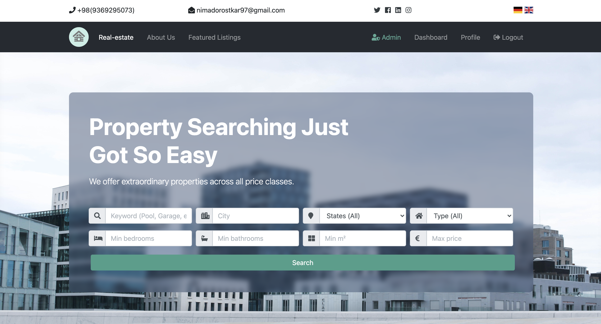
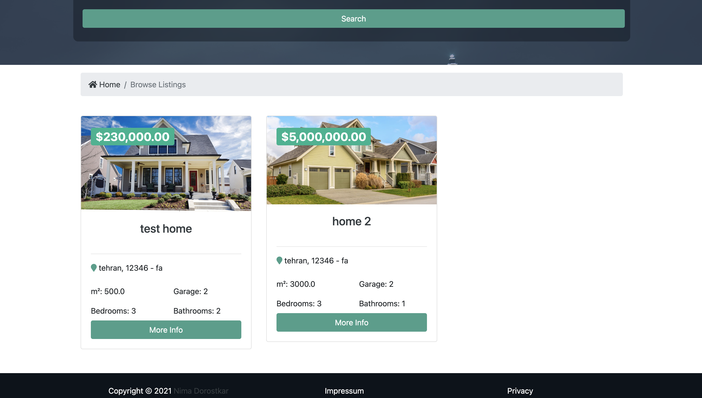
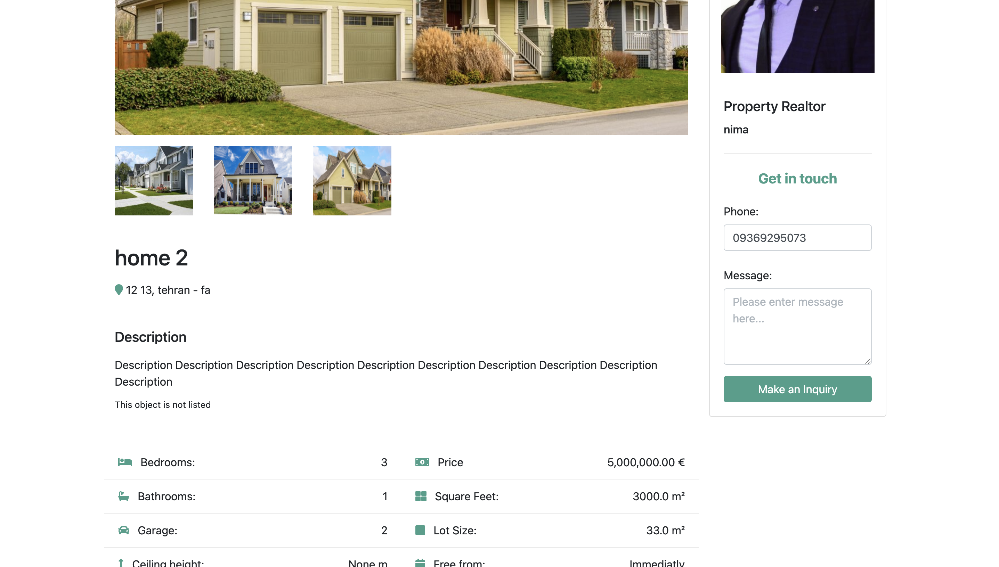

# 🏠 Django Real Estate Listing Platform

A backend system for managing real estate listings, realtor accounts, property locations, file uploads, and client interactions — all powered by Django.

---

## 📸 Admin Dashboard Preview






> Replace with your image path or GitHub raw URL once pushed.

---

## 🚀 Features

### 👥 Accounts
- Realtor & user management
- Email address tracking
- Admin-level access via Django Admin

### 🏘️ Listings & Documents
- Add, edit, and delete property listings
- Upload and manage listing files (docs, images, etc.)

### 🌍 Location Management
- Add countries, states, and detailed addresses
- Listings are linked to location records

### 💬 Contacts & Chat
- Store contact form entries
- View chat messages from interested clients

---

## 🛠️ Tech Stack

- **Backend**: Django
- **Database**: SQLite (for dev) / PostgreSQL (recommended for prod)
- **Admin Panel**: Django Admin
- **Authentication**: Django built-in (can extend with JWT)

---

## ⚙️ Setup Instructions

```bash
# 1. Clone the repository
git clone https://github.com/your-username/real-estate-backend.git
cd real-estate-backend

# 2. Create and activate a virtual environment
python -m venv venv
source venv/bin/activate  # or .\venv\Scripts\activate on Windows

# 3. Install dependencies
pip install -r requirements.txt

# 4. Run migrations
python manage.py migrate

# 5. Create a superuser to access admin
python manage.py createsuperuser

# 6. Run the development server
python manage.py runserver
```
